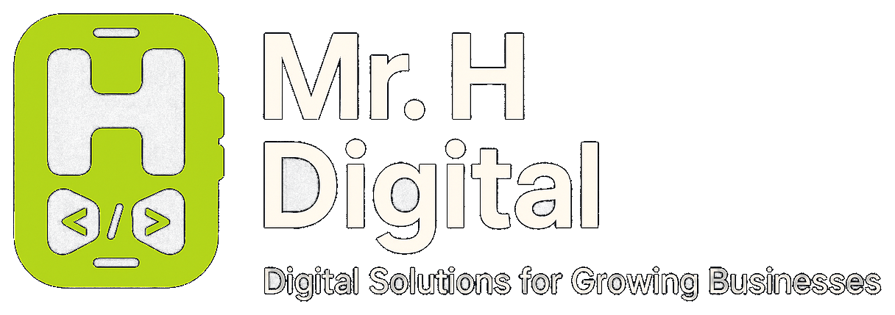

<p align="center">
	
</p>

<h1 align="center">TVECO — Invoice Generator</h1>

<p align="center">
	<strong>A fully branded invoice management web app for Timeline Vehicle Export Company (Pty) Ltd.</strong>
</p>

<p align="center">
	<a href="https://tveco.co.za">tveco.co.za</a>
	·
	<a href="mailto:enquiries@tveco.co.za">enquiries@tveco.co.za</a>
</p>

<p align="center">
	
	
	
	
	
</p>

---

## Overview

This repository contains the official internal invoice generator for **Timeline Vehicle Export Company (Pty) Ltd (TVECO)** — South Africa's trusted vehicle export specialists.

It is a full-featured single-page React application that enables TVECO staff to:

- Create, edit, duplicate, and manage invoices
- Maintain a database of export clients
- Print or save invoices as professionally branded PDFs
- Track invoice status (Draft → Sent → Paid / Overdue)
- Monitor outstanding revenue from a live dashboard

All data is persisted in the browser via `localStorage` by default. A Spring Boot BFF backend can be enabled via an environment variable for production use.

---

## Features

- **Cinematic splash screen** — animated TVECO truck background, stat counters (20+ yrs, 50+ countries, 500+ vehicles), fake boot terminal, orange progress bar, and pulsing "Ready" indicator
- **Branded login page** — full-screen hero photo with animated corner brackets and TVECO logo
- **Dashboard** — 4 financial stat cards + recent invoices list
- **Invoices** — create, edit, duplicate, delete, filter by status, search by client / invoice number, print to PDF
- **Live two-pane editor** — form on left, real-time invoice preview on right
- **Invoice preview** — dark-themed on-screen layout with TVECO logo, orange accents, and payment details
- **Print / PDF layout** — hybrid design: dark orange branded header, clean white body — professional A4 output
- **Clients** — add, edit, delete saved clients; auto-populated on invoice form
- **Correct banking details** — FNB Gold Business Account pre-filled on every new invoice
- **Branded 404 page** — "Road Ends Here" with animated corner brackets, TVECO logo, and quick-nav buttons
- **Fully responsive** — desktop sidebar + mobile drawer navigation
- **Mr. H Digital developer credit** — in sidebar and login screen

---

## Tech Stack

| Layer | Technology |
|---|---|
| Framework | React 19 + TypeScript |
| Build tool | Vite 8 |
| Styling | Tailwind CSS v4 (via `@tailwindcss/vite`) |
| State | Zustand |
| Forms | React Hook Form + Zod |
| Animations | Framer Motion |
| Icons | Lucide React |
| Routing | React Router DOM v7 (Hash Router) |
| Toasts | Sonner |
| HTTP | Axios (for Spring Boot BFF mode) |
| Fonts | Bebas Neue · Space Grotesk · Outfit |
| Storage | localStorage (default) · Spring Boot BFF (optional) |

---

## Project Structure

```text
tveco-invoice-generator-web-ui/
├── index.html
├── vite.config.ts
├── tailwind.config.ts        # (v4 — configured via @theme in index.css)
├── tsconfig.json
├── package.json
├── .gitignore
├── README.md
│
├── src/
│   ├── main.tsx
│   ├── App.tsx               # Splash → Login → App shell routing
│   ├── index.css             # Tailwind v4 theme + global styles + print styles
│   ├── vite-env.d.ts
│   │
│   ├── assets/               # Logos and background photos
│   │   ├── tveco-logo.png
│   │   ├── tveco-logo-dark.png
│   │   ├── tveco-login-bg.jpg
│   │   ├── tveco-nav-bg.jpg
│   │   ├── tveco-dashboard-bg.jpg
│   │   ├── tveco-invoices-bg.jpg
│   │   ├── tveco-clients-bg.jpg
│   │   └── mrh-digital-logo.png
│   │
│   ├── components/
│   │   ├── SplashScreen.tsx
│   │   ├── clients/
│   │   │   ├── ClientCard.tsx
│   │   │   ├── ClientForm.tsx
│   │   │   └── ClientSelector.tsx
│   │   ├── invoice/
│   │   │   ├── InvoiceCard.tsx
│   │   │   ├── InvoiceForm.tsx
│   │   │   ├── InvoicePreview.tsx
│   │   │   ├── InvoicePrintLayout.tsx
│   │   │   └── LineItemsTable.tsx
│   │   ├── layout/
│   │   │   ├── AppShell.tsx
│   │   │   ├── PageBackground.tsx
│   │   │   ├── Sidebar.tsx
│   │   │   └── TopBar.tsx
│   │   └── shared/
│   │       ├── Badge.tsx
│   │       ├── ConfirmDialog.tsx
│   │       ├── EmptyState.tsx
│   │       └── Modal.tsx
│   │
│   ├── hooks/
│   │   ├── useClients.ts
│   │   ├── useInvoices.ts
│   │   └── usePrint.ts
│   │
│   ├── pages/
│   │   ├── LoginPage.tsx
│   │   ├── DashboardPage.tsx
│   │   ├── InvoicesPage.tsx
│   │   ├── NewInvoicePage.tsx
│   │   ├── EditInvoicePage.tsx
│   │   ├── InvoiceDetailPage.tsx
│   │   ├── ClientsPage.tsx
│   │   └── NotFoundPage.tsx
│   │
│   ├── schemas/
│   │   ├── clientSchema.ts
│   │   └── invoiceSchema.ts
│   │
│   ├── services/
│   │   ├── api.ts            # Axios instance (BFF mode)
│   │   ├── clientService.ts  # localStorage ↔ API toggle
│   │   └── invoiceService.ts # localStorage ↔ API toggle
│   │
│   ├── store/
│   │   ├── authStore.ts
│   │   ├── clientStore.ts
│   │   └── invoiceStore.ts
│   │
│   ├── types/
│   │   ├── client.ts
│   │   └── invoice.ts
│   │
│   └── utils/
│       ├── formatCurrency.ts
│       ├── formatDate.ts
│       └── invoiceTotals.ts
```

---

## Local Setup

### Prerequisites

- Node.js 20+
- npm 9+

### Install & run

```bash
npm install
npm run dev
```

App runs at **http://localhost:5173**

### Build for production

```bash
npm run build
npm run preview   # preview the production build locally
```

---

## Default Login

> These credentials are for the local `localStorage` mode only. Swap `authStore.ts` for an API call when connecting to a real backend.

| Field | Value |
|---|---|
| Email | `admin@tveco.co.za` |
| Password | `tveco2026` |

---

## Invoice Number Format

```
TVECO-YYYY-NNN
```

Example: `TVECO-2026-004`

---

## Banking Details (pre-filled on all invoices)

| Field | Value |
|---|---|
| Bank | First National Bank (FNB) |
| Account Name | T S Concepts and Projects Enterprises (Pty) Ltd |
| Account Number | 63166663849 |
| Account Type | Gold Business Account |
| Branch Code | 200609 |
| Swift Code | FIRNZAJJ |

---

## Environment Variables

Create a `.env.local` file in the project root to override defaults:

```env
# Switch from localStorage to Spring Boot BFF
VITE_USE_API=true

# Backend base URL (defaults to http://localhost:8080/api)
VITE_API_URL=https://api.tveco.co.za/api

# Optional: notification email webhook (for export status/payment emails)
VITE_NOTIFICATION_WEBHOOK_URL=https://your-service.example.com/tveco/email
VITE_NOTIFICATION_WEBHOOK_SECRET=your_shared_secret

# Optional: public app URL used in client-facing email links
VITE_PUBLIC_APP_URL=https://app.tveco.co.za
```

When `VITE_USE_API=false` (the default), all data is stored in `localStorage` and no backend is required.

### Notification Email Webhook Payload

When configured, clicking "Dispatch Emails" in the Export Jobs page posts pending outbox emails to your webhook:

```json
{
	"id": "uuid",
	"to": "client@example.com",
	"subject": "TVECO Export Update: TVECO-EXP-2026-001",
	"body": "Your export job is now in SHIPPING stage.",
	"bodyHtml": "<html>...</html>",
	"createdAt": "2026-07-08T10:00:00.000Z"
}
```

Header (if secret configured):

```text
x-tveco-webhook-secret: <VITE_NOTIFICATION_WEBHOOK_SECRET>
```

Expected response: HTTP `2xx` for success.

---

## Storage Keys

The app uses versioned `localStorage` keys. Bumping the version suffix forces a re-seed with default data (useful after data model changes):

| Key | Contents |
|---|---|
| `tveco_invoices_v2` | All invoice records |
| `tveco_clients_v2` | All client records |
| `tveco_auth` | Authenticated user session |

---

## Deployment

The production build outputs to `dist/` — a fully static bundle that can be deployed to any static host.

| Platform | Steps |
|---|---|
| **Netlify** | Connect repo · build command: `npm run build` · publish dir: `dist` |
| **Vercel** | Connect repo · framework preset: Vite · output dir: `dist` |
| **GitHub Pages** | Use `gh-pages` branch · deploy `dist/` folder |
| **Any static host** | Upload contents of `dist/` |

> The app uses a **Hash Router** (`/#/dashboard`), so no server-side redirect rules are needed for SPA routing.

---

## Android Install (PWA)

This app is now configured as a **Progressive Web App (PWA)** and can be installed on Android.

### Requirements

- Deploy the production build over **HTTPS** (or use localhost for testing)
- Open the deployed URL in Chrome on Android

### Install steps

1. Open the app in Chrome
2. Tap the browser menu (`⋮`)
3. Tap **Install app** (or **Add to Home screen**)
4. Confirm install

The installed app launches in standalone mode and caches core assets for faster repeat loads.

---

## Brand Colours

| Token | Hex | Usage |
|---|---|---|
| Orange | `#FF6B00` | Primary accent, CTAs, active states |
| Orange Light | `#FF8C35` | Hover states |
| Orange Dark | `#CC5500` | Pressed states |
| Night | `#0A0C0F` | Page background |
| Dark | `#111318` | Secondary background |
| Card | `#181C23` | Card surface |
| Border | `#252B35` | Dividers and borders |
| Muted | `#8A99AE` | Secondary text |
| Text | `#C8D4E0` | Body text |
| White | `#F0F4F8` | Headings |

---

## Notes

- All background photos sourced from the official TVECO website assets (`tveco.co.za`)
- Print styles in `index.css` are tuned for A4 portrait — use browser print → "Save as PDF" on the invoice detail page
- The `mix-blend-mode: lighten` technique on the TVECO logo in the print header dissolves the black PNG background into the dark band

---

## Credits

- Client: Timeline Vehicle Export Company (Pty) Ltd
- Development and branding: Mr. H Digital

---

<p align="center">
	<strong>Development Signature</strong>
</p>

<p align="center">
	
</p>

<p align="center">
	Designed and developed by <a href="https://mrhdigital.co.za" target="_blank" rel="noopener noreferrer"><strong>Mr. H Digital</strong></a>
</p>
